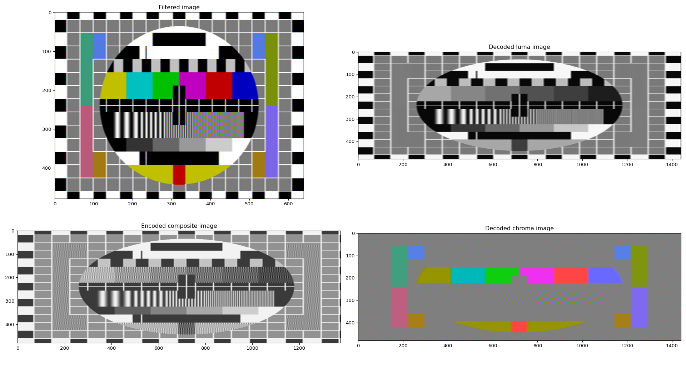

# Composite filter

yet another composite filter, in Python


this filter encodes an input image to composite baseband according to BT.1700 (no blanking, no sync), and then decodes back to RGB.


## Requirements

This script requires `numpy` for arrays and matrix math.

This script requires `scipy.signal` for signal processing.

This script requires `PIL.Image` for image file interactions.

This script requires `matplotlib` for graphs.

## Usage
```
usage: composite_filter.py [-h] [-dbg] [-skp] [-nnv] [-pfd] [-prg] [-isf] [-irs] [-war] [-pic] [-rsm RESOLUTION_MULTIPLIER] input_image

yet another composite filter

positional arguments:
  input_image           input image

options:
  -h, --help            show this help message and exit
  -dbg, --debug         enable debug plot
  -skp, --skip-plot     skip plot
  -nnv, --neigbor-vertical
                        use nearest-neighbor scaling for vertical resolution
  -pfd, --prefilter-disable
                        disable image lowpassiing before encoding to composite
  -prg, --progressive   scale to 240 lines instead of 480
  -isf, --interlace-separate-frames
                        output one file per field
  -irs, --input-resolution-samplerate
                        use the image input's horizontal resolution as samplerate. minimum is 720 pixels
  -war, --wide-aspect-ratio
                        use wide aspect ratio for output
  -pic, --phase-invert-colorburst
                        invert phase of colorburst
  -rsm RESOLUTION_MULTIPLIER, --resolution-multiplier RESOLUTION_MULTIPLIER
                        multiply the samplerate by x. makes the image sharper at the cost of filtering time

version 0.0.0
```

## License

This work is licensed under the MIT-0 license.

Copyright (C) Persune 2023.

## Credits

Special thanks to:
- NewRisingSun
- lidnariq
- Kagamiin
- PinoBatch
- LMP88959
- Lockster and forple

Dedicated to yoey

This would have not been possible without their help!
